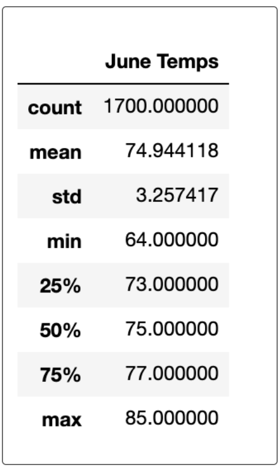
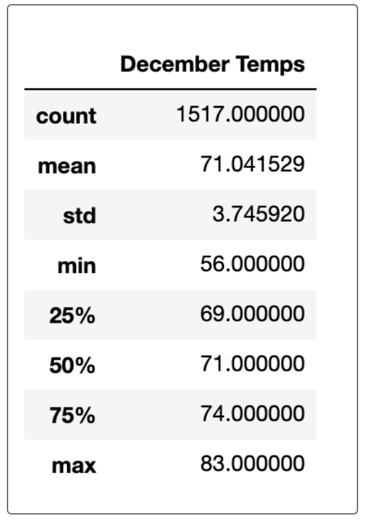

# Surf's Up
 
## The Focus
Avy and I have put together the analysis of the weather pattern in this beautiful island of Oahu. We plan to demonstrate how appropriate the weather pattern is for our surf and ice cream shop idea for both the coldest and hottest months of the year. 

## The Analysis
We have collected and analyzed the weather on the island for years; we elected to focus on June and December. Both 
summer and winter months in Oahu are perfectly warm and appropriate for surfing and consuming ice cream. The images of the maximum and minimum tempeartures are displayed for your reference. 
 - The max temp for June and December are only 2 degrees difference. 
 - The average temp for June and December are only 3 degrees difference.
 - The min temp for June and December have are only 8 degrees difference. 

As you can see, the maximkum tempearture for June is 85 degrees F, and for December is 83 degrees. And the minimum temperature is 64 and 56 respectively. Even for the coldest month of December, the average temp is 71 degrees, which is very ideal for surfing and enjoying ice cream. 

## The Summary
In addition to the average, max and min temperatures of June and December, we could also perform additional analysis of the number of days in the month the temperature was above or below the average tempearature to filter out the extreme weathers of the months. The temperature is only one of many factors for the success of a surf and ice cream shop. In addition to the summary statistics of temperature in June and December, we could do an analysis of the wind current, and precipitation. This would complete the analysis of weather in this locale. 